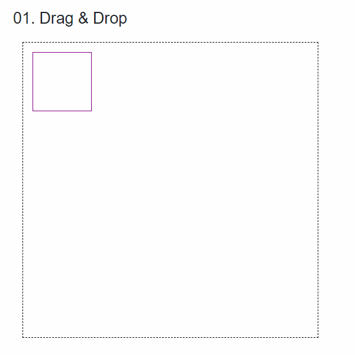

# 컴포넌트 마우스 이동

### 필요한 항목

1. Drag 할 수 있는 컴포넌트
2. Drop 할 수 있는 컴포넌트
3. 두 컴포넌트간의 데이터 공유 모델(없어도 데이터 전달방법은 많지만..)
4. 해당 컴포넌트를 표시할 페이지



```csharp
public class _01_DragAndDropService
{
    public int PosX { get; set; }
    public int PosY { get; set; }
    //마우스 드래그 시작할때의 좌표를 저장한다. 
    public void StartDrag(int posX, int posY)
    {
        this.PosX = posX;
        this.PosY = posY;
    }
}
```



```cshtml
@inject _01_DragAndDropService DragService

<div class="component" draggable="true" @ondragstart="@((e) => OnDragStart(e))"
     style=@("transform:translate("+ PosX +"px,"+PosY+"px);position:absolute;width:100px;height:100px;")>
</div>

@code {
    [Parameter] public int PosX { get; set; }
    [Parameter] public int PosY { get; set; }
    void OnDragStart(DragEventArgs e)
    {
        //공유 데이터 모델에 좌표를 저장한다. 
        DragService.StartDrag((int)e.ClientX, (int)e.ClientY);
    }
    public void Update()
    {
        StateHasChanged();
    }
}
```



```cshtml
@inject _01_DragAndDropService DragService

<div class="band" ondragover="event.preventDefault()" @ondrop="e=>OnDrop(e)"
     style=@("width:" + Width + "px;" + "height:" + Height + "px;" + "position:absolute;")>
    <_01_Component @ref=component></_01_Component>
</div>
@code {
    [Parameter] public string Width { get; set; } = "0";
    [Parameter] public string Height { get; set; } = "0";
    public _01_Component component { get; set; }
    void OnDrop(DragEventArgs e)
    {
        //컴포넌트가 이동된 상대좌표를 구한다. 
        int mouseMoveDictanceX = (int)e.ClientX - DragService.PosX;
        int mouseMoveDictanceY = (int)e.ClientY - DragService.PosY;
        
        //현재 컴포넌트에 상대좌표를 구해준다. 
        component.PosX = component.PosX + mouseMoveDictanceX;
        component.PosY = component.PosY + mouseMoveDictanceY;

        //실제 UI에 반영한다. 
        component.Update();
    }
}
```


위 케이스의 경우 @ref 를 사용해서 컴포넌트를 연결 시켰는데 이 경우 명시적으로 해당 컴포넌트의 UI를 갱신해줘야 한다.&#x20;

만약 해당 컴포넌트의 프로퍼티를 Tag 상에서 변경한 경우에는 따로 호출할 필요가 없다.&#x20;

<details>

<summary>Ex)</summary>

```cshtml
<_01_Component @ref=component PosX="posX" PosY="posY"></_01_Component>

@code
{
    int posX = 0;
    int posY = 0;
    void OnDrop(DragEventArgs e)
    {
        int mouseMoveDictanceX = (int)e.ClientX - DragService.PosX;
        int mouseMoveDictanceY = (int)e.ClientY - DragService.PosY;

        posX = component.PosX + mouseMoveDictanceX;
        posY = component.PosY + mouseMoveDictanceY;
    }
}
```

</details>


```cshtml
@page "/01"
<h3>01. Drag & Drop</h3>
<_01_Band Height="500" Width="500"></_01_Band>
```


<figure><figcaption></figcaption></figure>

