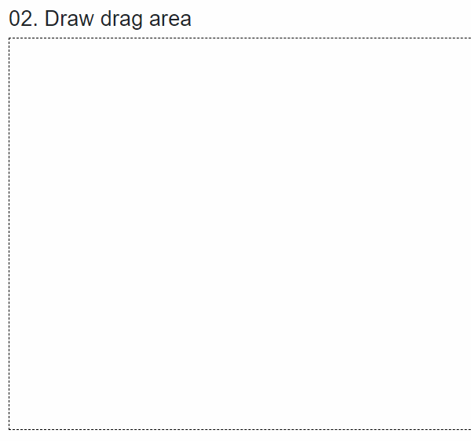

# 02. Draw Drag Area

### 필요한 항목

1. 드래그할 배경
2. 드래그를 표시할 태그

JavaScript 예제([http://jsfiddle.net/yck5ovx7/1/](http://jsfiddle.net/yck5ovx7/1/))를 보고 dragable-area에만 이벤트를 추가한 뒤 확인해 봤을  때 드래그가 끊기는 현상이 있었습니다. &#x20;

자세히 보면 구현에 있어서 차이점이 하나 있습니다.&#x20;

JavaScript 샘플은 document 전체에 이벤트를 걸었고, 아래 Razor 소스는 div 태그 하나에 이벤트를 걸었기 때문입니다.&#x20;

만약 dragable-area에만 이벤트가 있는 상태로 테스트하면 드래그해서 사이즈를 늘릴때는 dragable-area 영역에서  작업해서 정상동작 하지만,  사이즈를 작게 줄이는 순간 마우스가 위치한  곳이 drag-area 쪽의 영역이 되기 때문에 이벤트가 들어오지 않게 됩니다.&#x20;


```cshtml
@page "/02"
<h3>02. Draw drag area</h3>
<div class="dragable-area"
     @onpointerdown=OnMouseDown
     @onpointerup=OnMouseUp
     @onpointermove=OnMouseMove
     onmouseleave="event.stopPropagation()"
     ondragover="event.preventDefault()">
</div>

<div class="drag-area"
     @onpointerdown=OnMouseDown @onpointerdown:preventDefault
     @onpointerup=OnMouseUp @onpointerup:preventDefault
     @onpointermove=OnMouseMove @onpointermove:preventDefault
     style=@("width:" + dragWidth + "px;height:" + dragHeight + "px;" + 
     "left:" + left + "px;" + "top:" + top + "px;" ) hidden=@hidden>
</div>

<style>
    .drag-area
    {
        position: fixed;
        border:1px solid red;
    }

    .dragable-area
    {
        height:500px;
        border:1px dashed black;
    }
</style>
@code {
    double dragStartX;
    double dragStartY;
    double dragWidth;
    double dragHeight;

    double top;
    double left;
    bool hidden = true;
    void OnMouseDown(PointerEventArgs e)
    {
        left = dragStartX = e.ClientX;
        top = dragStartY = e.ClientY;
        
        dragWidth = 0;
        dragHeight = 0;
        hidden = false;
    }
    void OnMouseUp(PointerEventArgs e)
    {
        dragWidth = 0;
        dragHeight = 0;
        hidden = true;
    }
    void OnMouseMove(PointerEventArgs e)
    {
        if (hidden)
            return;

        var x = e.ClientX;
        var y = e.ClientY;

        dragWidth = Math.Max(x - dragStartX, dragStartX - x);
        left = Math.Min(dragStartX, x);

        dragHeight = Math.Max(y - dragStartY, dragStartY - y);
        top = Math.Min(dragStartY, y);
    }
}
```


<figure><figcaption></figcaption></figure>
