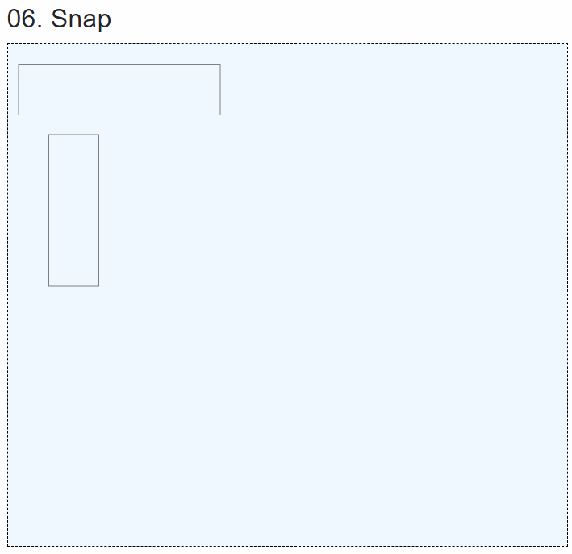

# Border 겹치는 문제

해결방법

1. box-sizing : content-box 로 설정해서 border 사이즈만큼 우측과, 하단 쪽으로 사이즈를 늘린다.\
   그리고 배경컬러를 줘서 겹쳐도 다음 컨트롤이 라인을 덮어 버리도록 한다. \
   장점 - 간단하게 1px 라인 처럼 보이게 할 수 있다. \
   단점 - 컨트롤의 z-index 에 따라서 특정 컨트롤이 튀어나와 보일 수도 있다.&#x20;
2. 겹치는 선의 라인을 삭제한다. \
   장점 - 수치상으로나 렌더링상에서 조차 설정한 pixel 그대로 표현 가능하다. (제일완벽)\
   단점 - 모든 컨트롤의 위치를 계산해서 겹치는 라인을 알아야 하고, 겹칠 경우에도 무조건 앞의 컨트롤의 라인을 삭제하는 것이 아니라, 겹치는 범위가 더 작은쪽의 라인을 삭제해야한다.&#x20;
3. 테이블 컨트롤을  사용한다.&#x20;
4. 마지막 렌더링할때만 width, height를 1씩 더해준다.\
   장점 - 아주 쉽다.\
   단점 - 실제 UI에는 1픽셀씩 늘어나는것처럼 보인다.

원래 2번으로 계산해 하다가 컨트롤 수백개 올라가면 계산하기 너무 어려워보여서, 그냥 4번으로 정했습니다.&#x20;

<figure><figcaption></figcaption></figure>
