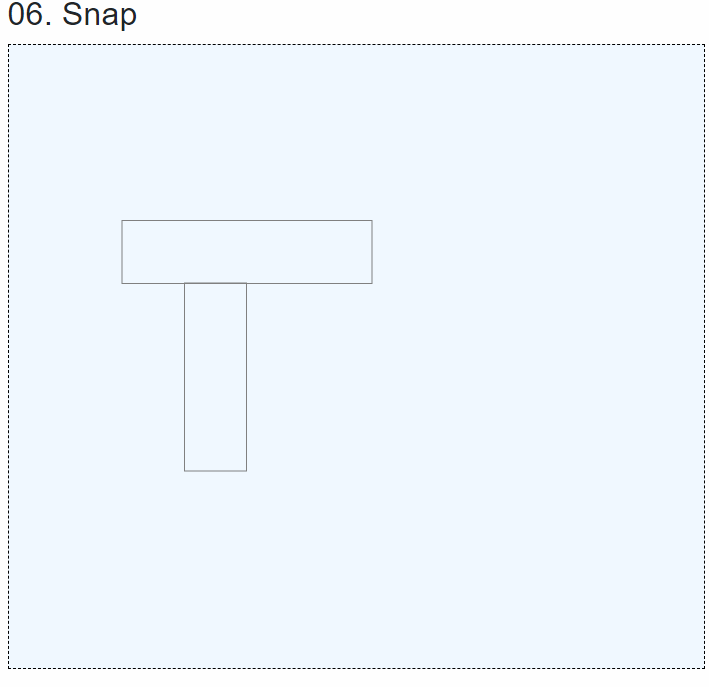

# 겹치는 컨트롤 빨간색 테두리

레포트 디자인을 할때 컨트롤을 겹치는것이 가능합니다.

레포트 자체로만 쓸때라면 상관없지만, 그걸 다른 문서로 변환하게 될 경우에는 문제가 발생합니다.&#x20;

물론 겹침이 지원되는 문서라면 상관없지만, 엑셀 같은 겹침자체가 없는 문서의 경우 디자인이 전부 틀어지게 됩니다.&#x20;


그렇기 때문에 사용자들에게 컨트롤이 겹치기 때문에, 문제가 발생할 수 있다고 표시할 필요가 있습니다.


컨트롤이 이동된 이후에 다음과 같이 체크를 해주면 됩니다.&#x20;

<details>

<summary>band.razor</summary>

```csharp
/// <summary>
/// 현재 선택된 컨트롤이 다른 컨트롤과 겹치는 계산해서, 겹칠경우 IsOverlap 속성을 변경합니다.
/// </summary>
private void CheckAreaOverlap()
{
    if (CurrentSelectedModel is null)
        return;

    int x1 = (int)CurrentSelectedModel.X;
    int x2 = (int)CurrentSelectedModel.Right;
    int y1 = (int)CurrentSelectedModel.Y;
    int y2 = CurrentSelectedModel.Bottom;
        
    CurrentSelectedModel.IsOverlap = false;

    foreach (_06_BaseControlModel control in Controls)
    {
        if (control.Equals(CurrentSelectedModel))
            continue;

        int cx1 = (int)control.X;
        int cx2 = (int)control.Right;
        int cy1 = (int)control.Y;
        int cy2 = (int)control.Bottom;

        if ((cx2 > x1 && cx1 < x2) && (cy2 > y1 && cy1 < y2))
        {
            control.IsOverlap = true;
            CurrentSelectedModel.IsOverlap = true;
        }
        else
            control.IsOverlap = false;
    }
}
```

</details>

<figure><figcaption></figcaption></figure>
