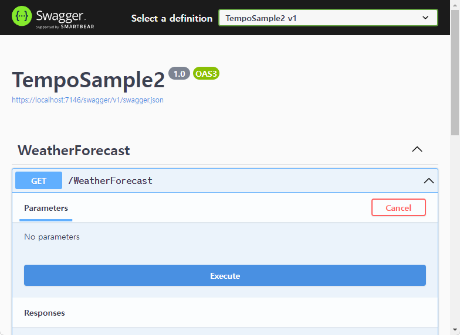
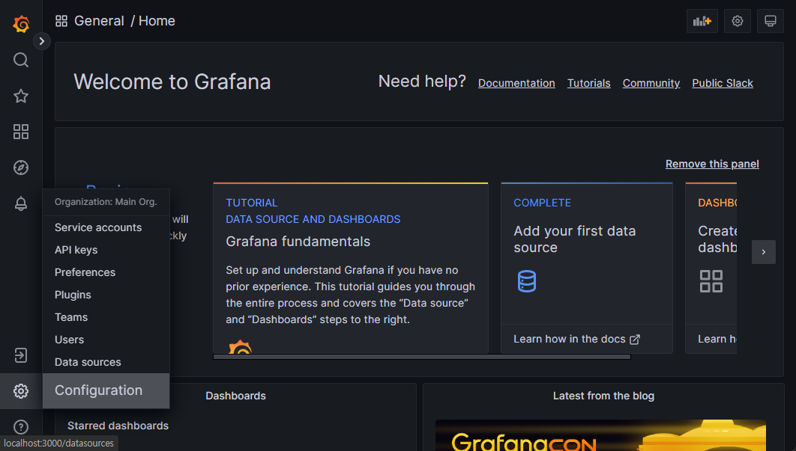
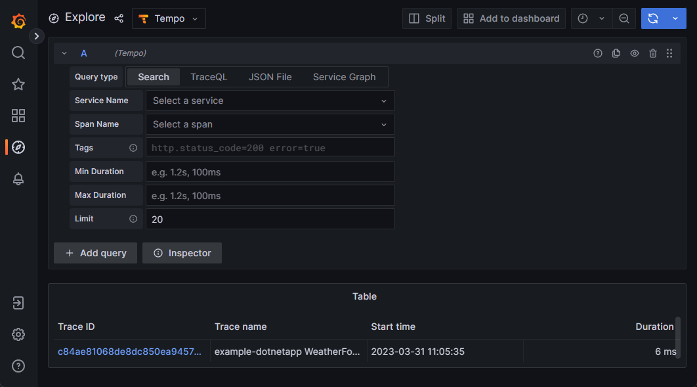
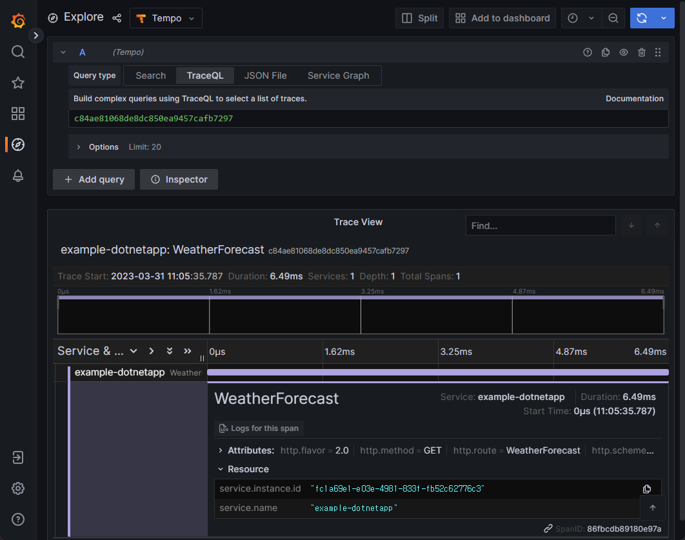
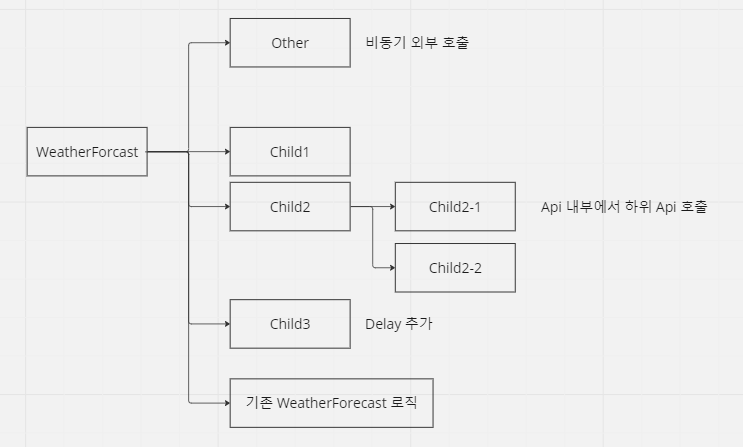
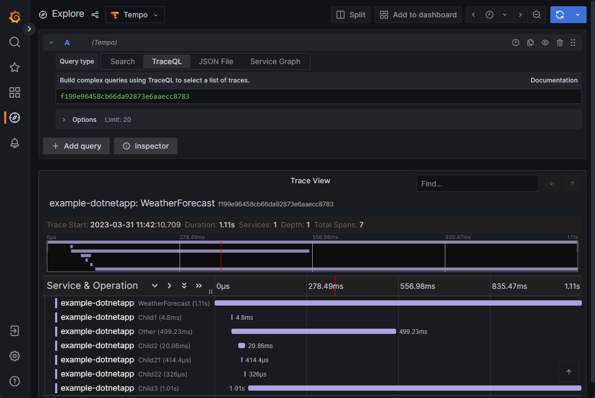

# Tempo Test

처음에 만들었던 .Net 프로젝트를 실행합니다.

기존처럼 동일하게 WeatherForecast API 를  Execute 버튼을  클릭합니다.

<figure><figcaption></figcaption></figure>

기존엔 콘솔창으로 확인했지만, 템포 및 그라파나를 설치했기 때문에 그라파나에서 확인을 합니다. http://localhost:3000/ 기본 아이디 비번 admin,admin

좌측하단 설정 -> Configration 클릭

<figure><figcaption></figcaption></figure>

Tempo -> Explore 클릭&#x20;

<figure><figcaption></figcaption></figure>

우측 상단 Run Query(파란색아이콘) 클릭&#x20;

<figure><figcaption></figcaption></figure>

방금 요청한 API에 대한 트레이스가 나옵니다.

템포와 그라파나를 거쳐오기 때문에 즉시 표시되진 않고, 몇초 정도 걸립니다.&#x20;

검색된 Trace ID를 클릭하면 상세 정보를 볼수 있습니다. 그러나 별 의미없는 단순 호출정보라서 (뭐 어쩌라고??) 생각됩니다.

<figure><figcaption></figcaption></figure>

참고로 현재 구축한 Trace 시스템은 아래와 같은 구성으로 동작됩니다.&#x20;

<div data-full-width="false">

<figure><figcaption></figcaption></figure>

</div>

단순한 API가 아니라. 실제 운영되는 서버처럼 복잡한 로직을 갖도록 프로젝트를 수정하겠습니다.

<figure><figcaption></figcaption></figure>

* 외부 API는 비동기로 호출하며 나머지 내부 API는 전부 동기로 호출합니다.
* 내부에서 한번더 내부 API를 호출하도록 하고
* 마지막 API는 오래걸리는 작업처럼 Delay를 추가합니다.
* 그리고 기존에 있었던 실제 WeatherForecast 로직을 그냥 둡니다.

<details>

<summary>새로운 빈 Controller를 생성하고, 아래의 코드를 붙여넣기 합니다.</summary>


```csharp
using Microsoft.AspNetCore.Mvc;

namespace TempoSample2.Controllers
{
    [ApiController]
    [Route("[controller]")]
    public class Child1Controller : ControllerBase
    {
        [HttpGet(Name = "Child1")]
        public string Get()
        {
            return "child 1";
        }
    }
    [ApiController]
    [Route("[controller]")]
    public class Child2Controller : ControllerBase
    {
        [HttpGet(Name = "Child2")]
        public async Task<string> Get()
        {
            using(var client = new HttpClient())
            {
                var uriBuilder = new UriBuilder(Request.Scheme, Request.Host.Host, Request.Host.Port ?? -1, "Child21");
                Console.WriteLine(uriBuilder.Uri);
                var result =  await client.GetStringAsync(uriBuilder.Uri);
            }
            using (var client = new HttpClient())
            {
                var uriBuilder = new UriBuilder(Request.Scheme, Request.Host.Host, Request.Host.Port ?? -1, "Child22");
                Console.WriteLine(uriBuilder.Uri);
                var result = await client.GetStringAsync(uriBuilder.Uri);
            }
            return "OK";
        }
    }

    [ApiController]
    [Route("[controller]")]
    public class Child21Controller : ControllerBase
    {

        [HttpGet(Name = "Child21")]
        public async Task<string> Get()
        {  
            return "child 21";
        }
    }

    [ApiController]
    [Route("[controller]")]
    public class Child22Controller : ControllerBase
    {

        [HttpGet(Name = "Child22")]
        public async Task<string> Get()
        {
            return "child 22";
        }
    }

    [ApiController]
    [Route("[controller]")]
    public class Child3Controller : ControllerBase
    {

        [HttpGet(Name = "Child3")]
        public async Task<string> Get()
        {
            await Task.Delay(1000);
            return "child 3";
        }
    }


    [ApiController]
    [Route("[controller]")]
    public class OtherController : ControllerBase
    {
        [HttpGet(Name = "GetW")]
        public async Task<string> Get()
        {
            using var client = new HttpClient();
            var result = await client.GetStringAsync("http://webcode.me");

            return result;
        }
    }
}
```


</details>

<details>

<summary>WeatherForecast 의 Get 메서드를 아래와 같이 수정합니다.</summary>

```csharp
[HttpGet(Name = "GetWeatherForecast")]
public async Task<IEnumerable<WeatherForecast>> Get()
{
    Task<string> tasks;
    var otherclient = new HttpClient();
    var otehruriBuilder = new UriBuilder(Request.Scheme, Request.Host.Host, Request.Host.Port ?? -1, "Other");
    tasks = otherclient.GetStringAsync(otehruriBuilder.Uri);

    using (var client = new HttpClient())
    {
        var uriBuilder = new UriBuilder(Request.Scheme, Request.Host.Host, Request.Host.Port ?? -1, "Child1");
        var result = await client.GetAsync(uriBuilder.Uri);
    }

    using (var client = new HttpClient())
    {
        var uriBuilder = new UriBuilder(Request.Scheme, Request.Host.Host, Request.Host.Port ?? -1, "Child2");
        var result = await client.GetStringAsync(uriBuilder.Uri);
    }

    using (var client = new HttpClient())
    {
        var uriBuilder = new UriBuilder(Request.Scheme, Request.Host.Host, Request.Host.Port ?? -1, "Child3");
        var result = await client.GetStringAsync(uriBuilder.Uri);
    }

    await tasks;

    return Enumerable.Range(1, 5).Select(index => new WeatherForecast
    {
        Date = DateOnly.FromDateTime(DateTime.Now.AddDays(index)),
        TemperatureC = Random.Shared.Next(-20, 55),
        Summary = Summaries[Random.Shared.Next(Summaries.Length)]
    })
    .ToArray();
}
```


</details>

실행하면 Swagger UI에 새로 생긴 api가 추가되었을텐데. 기존처럼 Weatherforecast api를 호출합니다.

그라파나로 들어가서 마지막에 호출된 TraceID를 클릭하면 우리가 추가한 API가 연속적으로 호출되며  쓸만한Trace 화면을 볼 수 있습니다. &#x20;

<figure><figcaption></figcaption></figure>

전체 호출에 1.11s가 걸렸으며

외부 Api는 499.23ms 가 걸렸지만 비동기로 호출되어서 전체 시간에 영향은 없고,

Child3 이 1초 대기를 두어서 1.01s
