# 3. Springboot 환경에서 자동계측

### 1. vscode 확장 프로그램을 설치합니다.

* Spring Boot Extension Pack (확장 설치 후에 jdk 까지 설치 합니다. )
* Extension Pack for Java

<figure>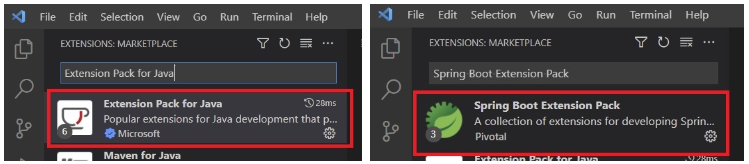<figcaption></figcaption></figure>

JDK가 설치되어 있지 않을 경우 아래의 창이 열리며, 다운받아 설치 합니다.&#x20;

<div data-full-width="false">

<figure>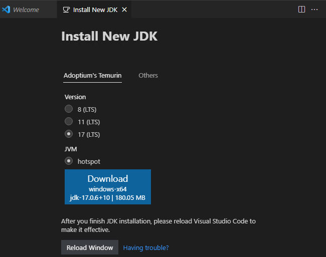<figcaption></figcaption></figure>

</div>

***

### 2. 기본 프로젝트 생성

gradle 환경의 프로젝트를 생성하기 위해 아래 확장 설치

<div align="left">

<figure>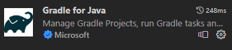<figcaption></figcaption></figure>

</div>

F1 키를 눌러서 스프링 프로젝트 생성을 시작합니다.    &#x20;

<figure>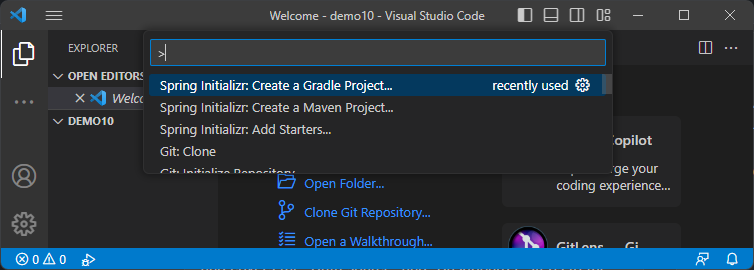<figcaption></figcaption></figure>

<figure>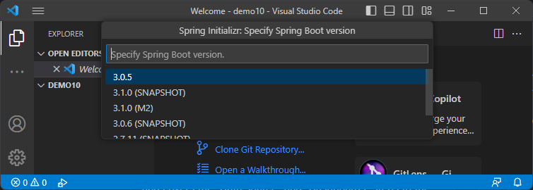<figcaption></figcaption></figure>

<figure>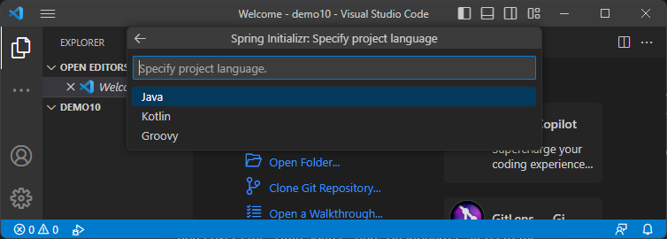<figcaption></figcaption></figure>

<figure>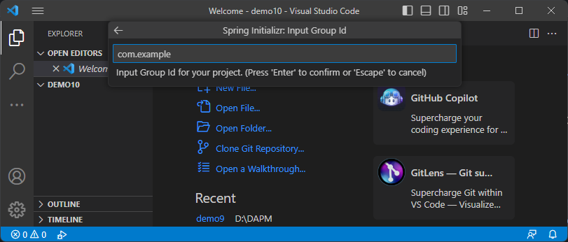<figcaption></figcaption></figure>

<figure>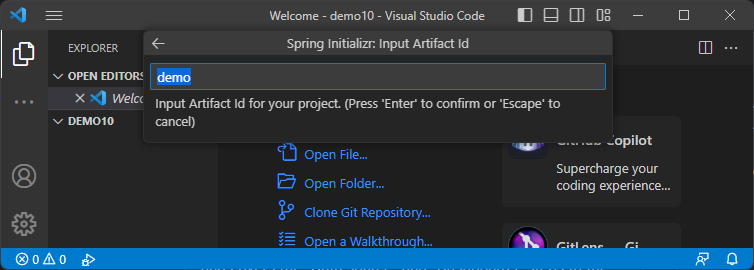<figcaption></figcaption></figure>

<figure>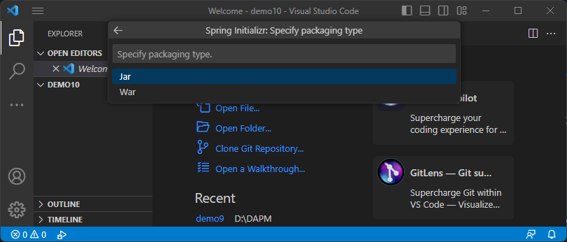<figcaption></figcaption></figure>

<figure>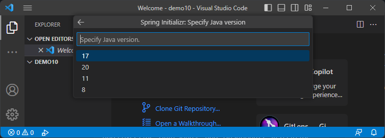<figcaption></figcaption></figure>

<figure>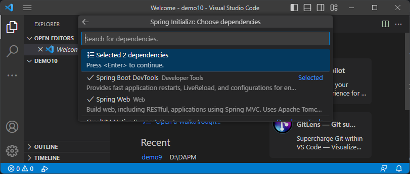<figcaption></figcaption></figure>

***

### 3. Swagger 추가

API 테스트를 위하여 Swagger 프레임워크를 추가합니다.

소스수정내역

1. ExampleController.java 추가 후 아래 코드 입력

```java
package com.example.demo;
import io.swagger.v3.oas.annotations.Hidden;
import io.swagger.v3.oas.annotations.Parameter;
import io.swagger.v3.oas.annotations.tags.Tag;
import org.springframework.web.bind.annotation.GetMapping;
import org.springframework.web.bind.annotation.RequestMapping;
import org.springframework.web.bind.annotation.RequestParam;
import org.springframework.web.bind.annotation.RestController;

@Tag(name = "예제 API", description = "Swagger 테스트용 API")
@RestController
@RequestMapping("/")
public class ExampleController {
    // @Operation(summary = "문자열 반복", description = "파라미터로 받은 문자열을 2번 반복합니다.")
    @Parameter(name = "str", description = "2번 반복할 문자열")
    @GetMapping("/returnStr")
    public String returnStr(@RequestParam("str") String str) {
        return str + "\n" + str;
    }

    @GetMapping("/example")
    public String example() {
        return "예시 API";
    }

    @Hidden
    @GetMapping("/ignore")
    public String ignore() {
        return "무시되는 API";
    }
}
```

2. application.properties 수정 (따로 추가하지 않아도 사용가능)

```properties
springdoc.packages-to-scan=com.example.demo
springdoc.default-consumes-media-type=application/json;charset=UTF-8
springdoc.default-produces-media-type=application/json;charset=UTF-8
springdoc.swagger-ui.path=/
springdoc.swagger-ui.disable-swagger-default-url=true
springdoc.swagger-ui.display-request-duration=true
springdoc.swagger-ui.operations-sorter=alphaapplication
```

3. build.gradle 에 의존성추가.

```gradle
dependencies {
    //springdoc 의존성추가.
	implementation 'org.springdoc:springdoc-openapi-starter-webmvc-ui:2.0.2' 
	...
}
```

수정하는 내역은 아래 형광색으로 표시했습니다.

<figure>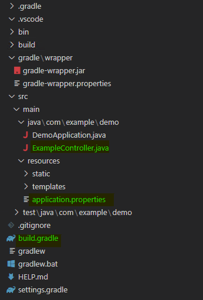<figcaption></figcaption></figure>

이후 gradle extention 에서 Tasks -> application -> bootRun 으로 실행 후 브라우저를 실행하여 localhost:8080 으로 정상동작을 확인합니다.

<figure>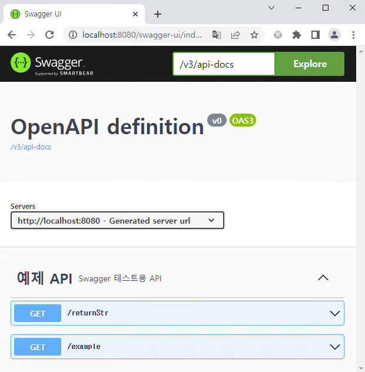<figcaption></figcaption></figure>


※ 앞으로 서버로 실행가능한 jar 파일을 만들기 위해서는 Tasks -> build -> bootJar으로 빌드 합니다.

<figure>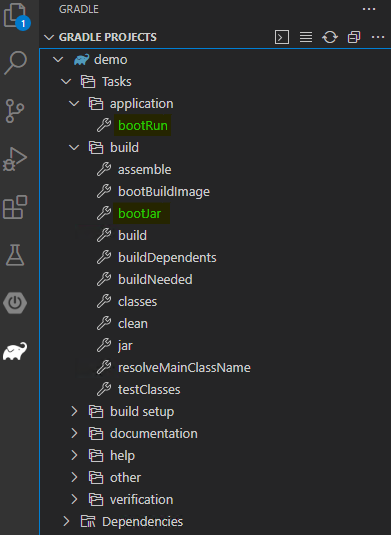<figcaption></figcaption></figure>

***

### 4. opentelemetry를 통한 Grafana Tempo 자동계측 추가

1. OpenTelemetry Instrumentation for Java 다운로드

* 깃허브 페이지 : https://github.com/open-telemetry/opentelemetry-java-instrumentation
* 다운로드 파일 : https://github.com/open-telemetry/opentelemetry-java-instrumentation/releases

2. 자바 옵션으로 다운받은 opentelemetry-javaagent-all.jar 파일 추가

```
JAVA_OPTS=-javaagent:/opentelemetry-javaagent-all.jar
```

3. 시스템 환경 속성 추가\
   윈도우의  경우  시스템 속성 -> 고급탭 -> 환경변수에  OTEL\_EXPORTER\_OTLP\_ENDPOINT 을 추가 가능하며 다음과 같이j실행가능합니다.   \
   \- java.exe -jar test.jar -javaagent:/opentelemetry-javaagent-all.jar

<div align="center">

<figure>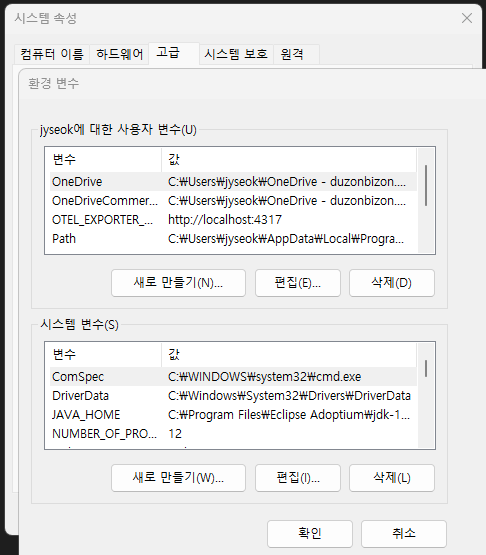<figcaption></figcaption></figure>

</div>

\
리눅스의 경우   /etc/profile 에 아래 환경 설정정보를 포함시킬수 있습니다.&#x20;

```
export OTEL_EXPORTER=otlp_span
export OTEL_EXPORTER_OTLP_ENDPOINT=https://localhost:4317
export OTEL_EXPORTER_OTLP_INSECURE=true
export OTEL_RESOURCE_ATTRIBUTES=service.name=SomeName
```

java의 경우 사전에 환경변수등록을 하지 않을 경우 JAVA\_OPTS 로 변경 불가능

자바옵션에 환경설정 내용까지 포함하여 스프링서버 실행

```
JAVA_OPTS= -javaagent:/opentelemetry-javaagent-all.jar 
-Dotel.exporter.otlp.endpoint=http://domain:4317
-Dotel.resource.attributes=service.name=test
```

닷넷의경우  endpoint를  소스상에서  입력한 후 빌드해서 사용했다면\
java의 경우 환경변수와 옵션으로 opentelemetry 에이전트를 추가하는 것자만으로도  계측이 가능합니다.

만약 endpoint를 특정 url로 하고싶을경우 아래와 같이 변경합니다.

```
OTEL_EXPORTER_OTLP_PROTOCOL="http/protobuf" 
Dotel.exporter.otlp.endpoint=http://domain/trace
```

참조   : https://github.com/open-telemetry/opentelemetry-java/blob/main/sdk-extensions/autoconfigure/README.md#otlp-exporter-both-span-and-metric-exporters

