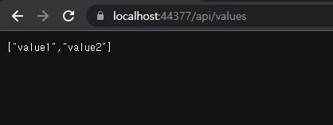

# Unity로 구현한 웹 리포트 뷰어

### 개발배경&#x20;

기존 인쇄 모듈을 웹버전으로 전환하기 위해서 진행했던 플랫폼 중 하나입니다.&#x20;

유니티를 이용해 WebGL을 사용하면 고성능에 고화질 렌더링 , 부드러운 애니메이션처리가 가능하기 장점이 있고, 기존 C# 모듈을 재사용 할 수 있기 때문에 프로토타입 개발을 진행했습니다.

프로토타입 개발 결과 일반적인 WASM은 지원안되는 멀티스레딩이 가능하여 고성능의 렌더가 가능하고, 어느 플랫폼이나 동일한 화면을 보여줄수 있다는 장점이 있으나,&#x20;

제일 중요한 인쇄 기능은 브라우저에서 바로 불가능 하기 때문에 "렌더링화면 파일저장 -> 파일 열어서 인쇄" 와 같은 단점이 생깁니다.&#x20;

하지만 단순 미리보기 기능만 제공한다면 이것보다 좋은 플랫폼은 없을거라 생각됩니다.\
(품질, 속도 모든 면에서)

그 이외의 단점으로라면 일반적인 웹 버전보다 큰 배포 용량으로 인한 로딩시간의 문제가 있고, \
(그러나 AOT 적용한 Blazor WASM 버전과 비교하면 비슷한 용량입니다. )

다국어 지원시 PC에 각 폰트가 설치되지 않아도 되는 장점이 있지만, 각 언어별로 만드는 폰트가 커서 역시 배포용량이 늘어나는 단점도 있습니다.

<figure><figcaption></figcaption></figure>
