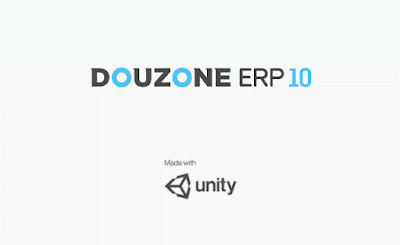
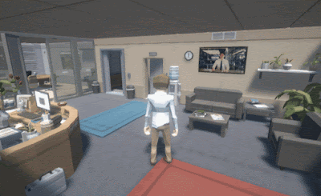
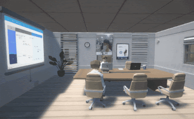
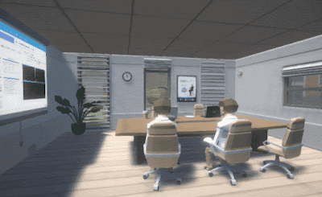

# Unity Webgl 화상면접 공간 개발

### 목적 : 메타버스 프로젝트진행하기 전 개발 가능성 확인

#### 조건 : 멀티플레이 + 화상 + 웹브라우저

\
기간 : 2021.11.03 \~ 2021.11.25

#### 개발 SDK 선정

* 멀티플레이 ->  [https://www.photonengine.com/](https://www.blogger.com/blog/post/edit/3181323245558651824/3296712724817410410)
* 화상채팅 -> [https://www.agora.io/en/](https://www.blogger.com/blog/post/edit/3181323245558651824/3296712724817410410)

***

### WebGL이슈

* &#x20;매우 낮은 캐릭터 및 지형 폴리곤 사용
* 노멀맵없이 기본맵만 사용
* 유투브 등, 외부링크 연동 -> CORS 문제 발생 -> 내부서버로 연결되게 프록시서버 구축 필요
* Safari에서 WebGL 2.0을 지원하지 않아서 품질저하문제
* 포톤은 WebGL에서 음성 지원이 안됨 -> Agora에서 화상 음성 전부 처리
* 화상및음성은 브라우저 보안 이슈로 HTTPS로 구동시켜야함.
* 한글입력안됨(TextMeshPro를 통해서 한글 폰트생성)
* IME 설정안됨 -> 일본사람이 만든 Asset 사용해서 처리

***

### 기본샘플

Agora와 Photon 을 조합한 샘플이 Agora에서 제공되고 있습니다. (WebGL은 제외)

\- [https://github.com/AgoraIO-Community/agora-unity-partychat-demo](https://www.blogger.com/blog/post/edit/3181323245558651824/3296712724817410410)

<figure><figcaption></figcaption></figure>

자세한 코드 분석은 위의 소스를 확인합니다.&#x20;

***

### 개발가이드

* Unity용 SDK를 다운로드 받아서 추가합니다. \
  ([https://docs.agora.io/en/All/downloads?platform=Unity](https://www.blogger.com/blog/post/edit/3181323245558651824/3296712724817410410))
* 샘플 프로젝트를 다운로드 받습니다.\
  ([https://github.com/AgoraIO-Community/agora-unity-partychat-demo](https://www.blogger.com/blog/post/edit/3181323245558651824/3296712724817410410))
* Unity WebGL용을 다운로드 받아서 덮어 씌웁니다.\
  ([https://github.com/AgoraIO-Community/Agora\_Unity\_WebGL](https://www.blogger.com/blog/post/edit/3181323245558651824/3296712724817410410))
* 실제 서비스하기 위해서는 아고라에 가입하고 APP ID 및 토큰을 발급받아서 사용해야 합니다. 그러나 테스트용으로 사용시 저 샘플의  APP ID를 사용해도 가능합니다. 대신 채널명을 고유하게 변경하여 다른 사람들과 중복되지 않도록 합니다.&#x20;
* 샘플프로젝트의 SceneHome 씬을 실행후 GameController 에 APP ID 를 넣는 부분이 있습니다.(기본 샘플 ID가 입력되어 있습니다)

<figure><figcaption></figcaption></figure>

* &#x20;빌드 옵션에서 WebGL Template를 agoaTemplate2020 으로 변경합니다.(Unity 2020 버전 기준)
* &#x20;Asset 폴더내에 WebGL Templates 폴더가 있으면 표시됩니다.&#x20;

<figure><figcaption></figcaption></figure>

* 이후 WebGL로 빌드를 하고 웹서버에 올려서 테스트를 합니다.&#x20;
* ※ 화상통신은 HTTPS에서만 가능합니다. 웹서버를 HTTPS로 구성하세요.

#### Agora - Photon - WebGL 결합하기

* 그냥 프로젝트를 바이킹 프로젝트로 변경후에 실행하면 됩니다.&#x20;

현재 프로젝트의 구조는&#x20;

1. 포톤으로 멀티플레이 룸 생성
2. 포톤방 참가 -> 캐릭터 프리팹이 생성됨
3. 캐릭터 프리팹에서 아고라채널 참가
4. 캐릭터 프리팹에서 아고라채널 원격참가자가 들어옴. -> 캐릭터 생성

* photonview.isMine 을 이용해서 현재 프리팹이 플레이어인지 원격 캐릭터인지 판단해서 처리되고 있습니다

\

***

### 실제구현방법

1. 샘플소스 구조 그대로 WebGL 정상동작테스트 -> 여기서 인증서 만들어 HTTPS 구성 - OK!
2. &#x20;캐릭터위에 화상 표시하기 - 포톤과 아고라의 아이디? 키 등을 같은값으로 사용해야함.- 포톤을 먼저 접속하기 때문에 포톤의 아이디값으로 아고라 채널에 접속해서 처리- WEBGL 용으로 아이디 값을 넘기는게 없었기 때문에 아고라 라이브러리(JAVASCRIPT) 수정- OK!\
   여기까지 핵심기능완료
3. &#x20;프로토타입용 디자인 에셋 구매- 맵 디자인(기본 예제 디자인에서 원활한 플레이가 가능하게 버텍스 줄이기)- 각종 회사 이미지 및 애니메이션 맵에 배치- 캐릭터 선택씬 개발
4. 여기서 구조최적화 (항상 찾아오는 갈아엎기)- 기존 캐릭터 프리팹에서 전적으로 처리하던것을 삭제하고- 각각 싱글톤 매니저로 방생성 입장 , 화상연결, 캐릭터 생성 등등 개별적으로 조작

<figure><figcaption></figcaption></figure>

5. 각종 부가기능개발- PDF 뷰어- 캐릭터 애니메이션 - 이름 표시하기- 로딩씬구현- 포톤으로 위 모든것 동기화 시키기 + 시야변경 명령하기 등

* 구글 STT를 이용하여 채널에 접속한 유저에게 목소리를 메시지로 전달하고 싶었는데WebGL용 채팅 SDK가 포톤 아고라 둘다 지원하지 않았기 때문에 구현못함.- 하는수없이 정식지원하는 채팅이 아니라, 비효율적이지만 포톤으로 게임오브젝트의 값을 동기화 하는 방법으로는 채팅 구현.\

***

### 최종결과물(WebGL 에서 플레이영상)

<figure><figcaption></figcaption></figure>

<figure><figcaption></figcaption></figure>

<figure><figcaption></figcaption></figure>

<figure><figcaption></figcaption></figure>
