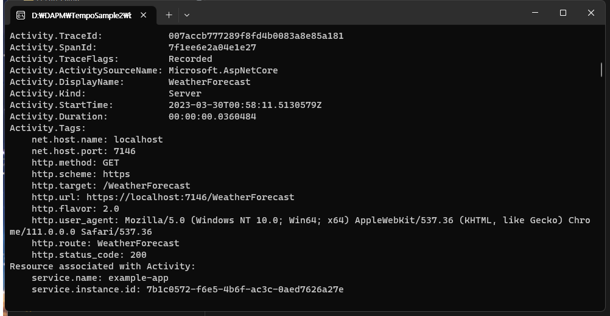

# 2. .Net 환경에서의 자동계측

목표 : .Net 웹 서버의 Trace을 OpenTelemetry로 내보내기

### 1. 기본적인 콘솔창으로 Trace 내보내기

**ASP .Net Core 웹 API** 프로젝트를 생성합니다.

<figure><figcaption></figcaption></figure>

<figure><figcaption></figcaption></figure>

누겟 패키지 설치

```
OpenTelemetry.Extensions.Hosting 1.4.0
OpenTelemetry.Instrumentation.AspNetCore 1.0.0-rc9.14
OpenTelemetry.Exporter.Console 1.4.0
```

<figure><figcaption></figcaption></figure>

program.cs 에 다음 코드를 삽입합니다.

```C#
builder.Services.AddOpenTelemetry()
       //추적사용
       .WithTracing(builder => builder
       //현재 분석하는 서비스를 example-app로 명명
       .SetResourceBuilder(ResourceBuilder.CreateDefault().AddService("example-app"))
       //기본 AspNet 작업 포함
       .AddAspNetCoreInstrumentation()
       //콘솔로 내보내기
       .AddConsoleExporter());
```

<details>

<summary>정상 동작 확인하기</summary>

1. 프로젝트를 실행합니다.
2. 서버가 실행된 콘솔창과 웹 브라우저가 열립니다.
3.  Swegger 웹에서 기본적으로 생성된 Get Method를 Execute 합니다.

    <figure><figcaption></figcaption></figure>
4.  등록한 example-app 이 콘솔창에 service.name 으로 출력됩니다.

    <figure><figcaption></figcaption></figure>
5. **이것만 보면 잘 알**
6. **5-수 없지만, 어쨌든 제대로 Trace가 되어 출력되고 있습니다.**

</details>


### 2. Grpc로 내보내기 추가

누겟 패키지 설치

```
OpenTelemetry.Exporter.OpenTelemetryProtocol 1.4.0
Grpc.Core 2.46.6
```

program.cs 에 다음 코드를 삽입합니다.

```C#
builder.Services.AddOpenTelemetry()
       //추적사용
       .WithTracing(builder => builder
       //현재 분석하는 서비스를 example-app로 명명
       .SetResourceBuilder(ResourceBuilder.CreateDefault().AddService("example-app"))
       //기본 AspNet 작업 포함
       .AddAspNetCoreInstrumentation()
       //콘솔로 내보내기
       .AddConsoleExporter()
       //OpenTelementry 로 내보내기
       .AddOtlpExporter(opt =>
               {
                    //도커사용시 서비스이름을 호스트이름오로 사용가능합니다. 
                    opt.Endpoint = new Uri("http://127.0.0.1:4317");
                    opt.Protocol = OpenTelemetry.Exporter.OtlpExportProtocol.Grpc;
               }));
```

위와같이 구성한 경우 트레이스로 수집한된 데이터가 Endpoint로 전송이 됩니다.

저 EndPoint가 Tempo의 Grpc 포트와 매칭되면 자동으로 수집된 데이터가 템포로 들어가게 됩니다.
