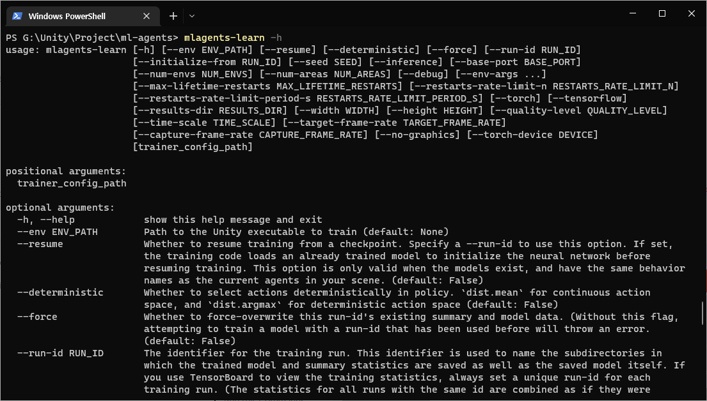
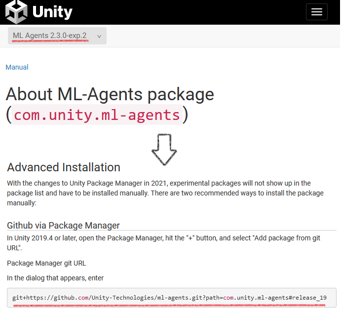
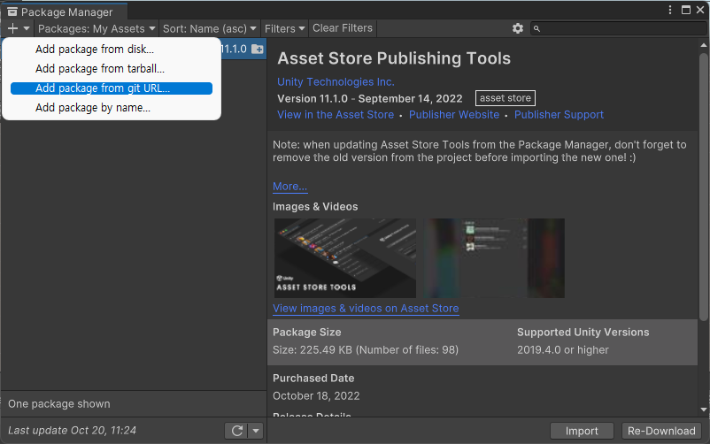
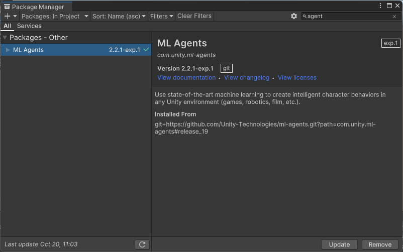

# 1. 환경구성

### 2022.10.21 기준 설치 정보는 다음과 같습니다.

<table><thead><tr><th width="164" align="center">Version</th><th width="185" align="center">Release Date</th><th width="219" align="center">Paython Package</th><th align="center">Unity Package</th></tr></thead><tbody><tr><td align="center">Release 19</td><td align="center">January 14, 2022</td><td align="center">0.28.0</td><td align="center">2.2.1</td></tr></tbody></table>

### 파이썬 설치

* 현재 ML-Agents Release19 버전은 Python3.9 이후 버전에서 지원되지 않기 때문에, 반드시 **Python 3.8버전**으로 다운받습니다.
*   [**공식사이트 다운로드 페이지로 이동 및 다운로드(클릭)**](https://www.python.org/downloads/windows/)\


    <figure><figcaption></figcaption></figure>
* 설치화면에서 **"Add Python.exe to PATH"** 를 체크하여 환경변수를 추가합니다.

**ML Agents 관련 파이썬 패키지 설치**

```sh
-- 1. 작업할 디렉토리를 만들고 깃에서 관련 소스를 가져오기
$ git clone --branch release_1 https://github.com/Unity-Technologies/ml-agents.git
$ cd ml-agents

-- 2. 관련 툴 설치
$ sudo pip3 install setuptools --upgrade

-- 3. ml-agents 설치 및 환경 설치
$ sudo pip3 install -e ./ml-agents-envs
$ sudo pip3 install -e ./ml-agents
```

**파이토치 설치**


```
pip3 install torch torchvision torchaudio --extra-index-url https://download.pytorch.org/whl/cu113
```


**최종 설치확인**

```
mlagents-learn -h
```

*   정상적으로 설치한 경우 아래와 같은 화면이 표시됩니다. \


    <figure><figcaption></figcaption></figure>
* 빈 프로젝트를 하나 생성합니다.
* 패키지 매니저에서 ML Agents 를 검색하면 2.0.1 버전이 검색됩니다.
*   최신 버전이 아니기 때문에 [**ML Agents Unity 공식 문서**](https://docs.unity3d.com/Packages/com.unity.ml-agents@2.3/manual/index.html) 에서 설치 정보를 가져옵니다.\
    _(작성당시 최신버전은 2.3.0-exp2)_\


    <figure><figcaption></figcaption></figure>
* git+https://github.com/Unity-Technologies/ml-agents.git?path=com.unity.ml-agents#release\_19
*   위의 주소를 복사해서 Package Manager의 **+** 버튼 클릭후 **Add package from git URL...** 을 선택하여 붙여 넣기 한 후 설치를 진행합니다.\


    <figure><figcaption></figcaption></figure>


    <figure><figcaption></figcaption></figure>

&#x20;


이것으로 기본적인 유니티와 파이썬의 패키지버전을 설치했습니다.
