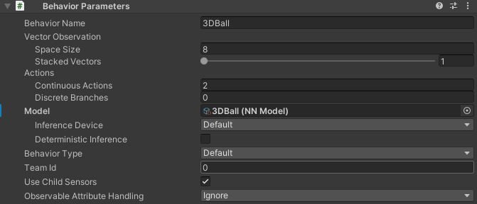
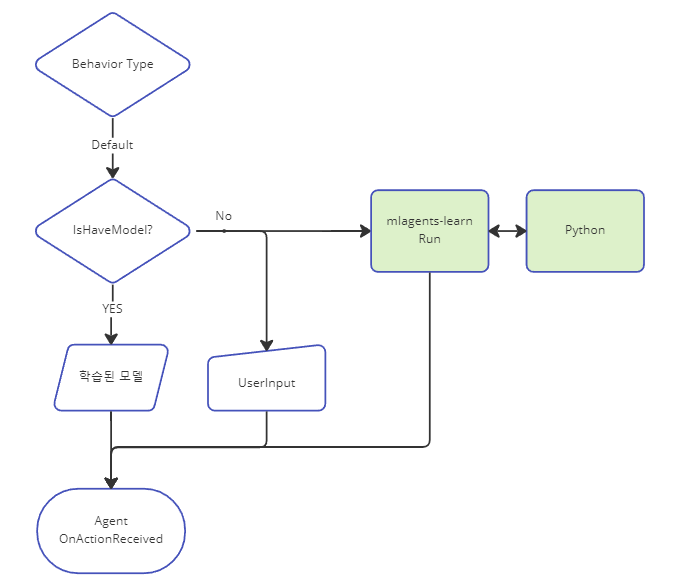
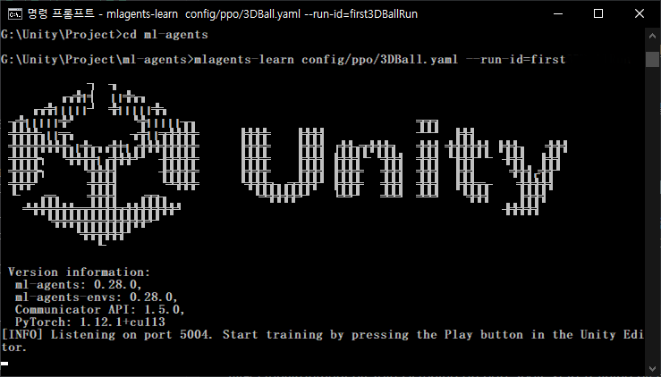
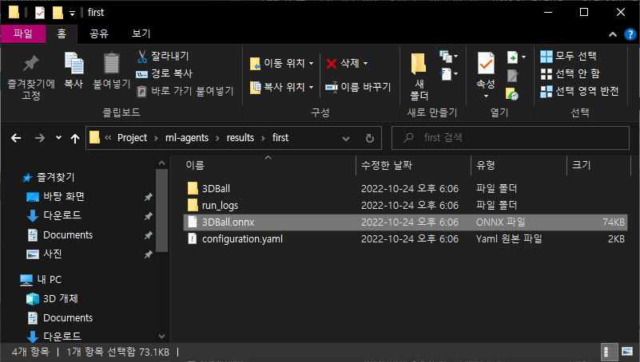

# 2. 튜토리얼 실행하기

앞서 ML-Agents의 깃을 다운로드 받은 경로에서 아래두 폴더를 현재 프로젝트로 복사해 옵니다.

```
./Project/Assets/ML-Agents/Examples/3DBall 
./Project/Assets/ML-Agents/Examples/SharedAssets 
```

3D Ball 데모 씬을 로드한 후에 플레이 버튼을 눌러보면 공이 아래로 떨어지지 않게 중십을 잡고 있는 모습을 볼 수 있습니다.&#x20;

<figure><figcaption></figcaption></figure>

3DBall 프리팹 -> Agent GameObject -> Behavior Parameter Script-> Model 속성에 학습된 모델(3DBall-NNModel)이 적용되어 있어서 위와 같이 에이전트가 행동을 하게 됩니다.&#x20;

<figure><figcaption></figcaption></figure>

먄약, 저부분에   Model을 넣지 않고  플레이를 시키면 학습을 시킬 수 있습니다.&#x20;

학습의 종류는 ml-agents 및 사용자 입력 에 따라 가능하며,

현재 ml-agents가 실행되어 있지 않기 때문에 사용자입력 만 적용됩니다.&#x20;

<figure><figcaption><p>Play 버튼을 눌렀을때 동작 구조</p></figcaption></figure>

Cmd 창을 열고 프로젝트 경로로 이동한 후, 아래의 명령어를 입력하여 ml-agents 를 실행합니다.

```
mlagents-learn config/ppo/3DBall.yaml --run-id=first
```

<figure><figcaption></figcaption></figure>

ml-agents 2.0.1 버전에서는 과거의 --train --load 같은 파라메터가 사라졌습니다.

훈련하기 위해서는 그냥 --run-id 만 입력하면 되고, 이어하려면 --resume 파라메터만 추가하면 됩니다.

```
--run-id="훈련할이름"
--resume(이어하기)
```


```
INFO [environment.py:204] Listening on port 5004. Start training by pressing the Play button in the Unity Editor.
```


이 메시지가 나오 후에 Unity에서 Play 버튼을 누르면 훈련을 시작하게 됩니다.

훈련 종료 후 결과는 ./reusult/run-id 폴더에 생성됩니다.

<figure><figcaption></figcaption></figure>

.onnx 파일을 agent 프리팹의 Model 에 할당한 후 플레이해서 정상적으로 훈련되었는지 확인해 봅니다.
