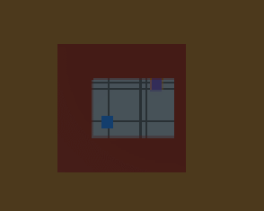
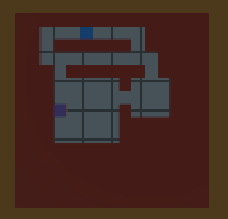

# 4. 실제 적용 취소한 이유

* **학습이 생각처럼 원만한게 진행되지 않음.**
* **해결을 가능해 보이지만 유의미한 결과를 내기 위해서 학습하는 기간이 너무 오래 걸림.**

개발하다가 막히는 경우야 비일비재 하고 그걸 해결하는게 당연한데, 이 ML-Agents는 코드를 수정하고 학습시키는데 오랜 시간이 걸릴수 밖에 없습니다.

물론 제가 게임의 AI를 전담해서 만드는 역활만 한다면 당연히 계속 했을 테지만, 혼자서 모든걸 개발해야하는 입장에서, 빠른 개발을 위해 전통적인 FSM로직을 사용해야겠다는 판단을 내려야 했습니다.

(기존에 잘 개발하다가 유튜브보고 혹해서 3주의 시간을 투자했습니다.)

## **제가 작업한 내용을 시간순대로 나열하면**

1. 10 x 10 맵 생성후 agent가 target 이동
2. target , agent 위치 랜덤추가
3. 15 x 15 맵 20 X 20 맵 등등 점점 사이즈를 증가하며 학습
4. 벽 추가(맵의 10%수준) -> 기존 Vector 관찰로 학습이 어려움. (raycast, grid, renderTexture 등등 사용 시도)
5. 다른 사람이 만든 멋진 GridSensor 컴포넌트 사용 - [깃허브 링크](https://github.com/mbaske/grid-sensor)
6. 벽이 있을 경우에도 정상적으로 학습됨 확인
7. 실제 던전지형 생성 학습
8. 사이즈를 증가시키며 학습 -작은 사이즈에서는 정상, 맵 사이즈가 늘어나니 길을 잘 못찾음.
9. 원하는 조건의 AI를 만들기까지 오래걸린다고 판단되어 **중단결정**

<figure><figcaption>
턴 제 RPG에서 몬스터가 플레이어에게 다가가기 예제
</figcaption></figure>

중간까지 학습한 거라서 최적의 경로로 이동하지 않지만, 맵 사이즈가 작을 경우에는 잘 찾습니다.&#x20;

<figure><figcaption>
맵 사이즈가 늘어나니 학습이 어려워짐
</figcaption></figure>

그러나 맵 이 커질 경우에는 가끔 AI가 멍청하게 행동할 때가 있습니다.

## <mark style="color:red;">학습이 제대로 안된거죠</mark>

이것은 결국 학습 보상 결정에 대한 문제로 조금씩 수정해 나가면 되지만, 여기서 문제점은 이런 미세조정을 하기 위해서 학습할 때마다 **10\~20분정도(AMD 5600)** 걸리게 된다는 점 입니다. \
(에디터 내에서 25개 환경을 복제해서 사용. 100개까지 복제해봤지만 큰 시간 감소는 발견할 수 없습니다.)

실제 코드 상으로는 몇 줄 수정 안 했는데 이걸 테스트하기 위해서 걸리는 시간이 너무 오래 걸리니까, 개발 일정을 예상할 수 가 없었습니다.

**그럼 이 문제를 해결하기 위해서는 어떻게 해야할까요?**

1. 잘 이해하고, 이론적으로 확실한 보상 체계를 확립한 상태에서 개발한다??&#x20;
2. Unity 스크립트 컴파일처럼 단시간내에 일정 보상확률(최대 보상의 95%정도) 학습이 가능해야 한다.

<mark style="color:blue;">**그리고 유니티에서 제공하는 학습시간을 단축시키기 위한 방법이 있습니다.**</mark>

1. 빌드 후 클라이언트를 동시에 여러개 실행해서 학습.
2. 빌드 후 구글 클라우드를 통한 학습.

전제조건이 있죠?? **빌드....**

에디터 모드에서 학습이 아닌 빌드 후 연동해서 학습.

물론 전체 학습시간 대비 빌드시간은 얼마 안될 수 있지만, 느낌이 다르죠. 그리고 학습초기에 완전 망한거면 바로 다시 수정할때도 있는데, 이런경우는 너무 번거롭지 않을까요?

분명히 에디터에서도 다중 시스템을 이용해서 학습하는게 가능할텐데 아직 지원이 되지 않습니다.

***

**넉두리를 하자면**

* 제 생각엔, 아마도 다들 똑똑해서 필요없다고 생각하는듯 합니다. 일반적으로 배우는 사람이 저런 단순한 보상처리에서 고민할거라고 생각하지 않기 때문에, 그냥 학습 고도화를 하기 위해 오래 걸리는 시간만 단축시키기 위해 노력한거겠죠.
* 2.0 버전까지 왔으면서 왜 cmd 창에서 실행시켜야 하는지 모르겠네요. Editor 창에서도 충분히 가능할텐데..
* 설치왜 각각 시키는지도 모르겠어요. ml-agents Release 버전별로 파이썬 및 파이토치를 지원하는 버전이 따로 있는데 그냥 묶어서 실행파일 하나로 인스톨을 만들수 있을텐데요.

제가 닷넷 클라개발자로만 살아서 UI 없는걸 싫어하기 때문에 이렇게 생각하는걸 수도 있겠습니다.

\

**다음 포스트에서 중단하기 전까지 실제 구현방법에 대하여 정리하겠습니다.**

**필요하시다면 보상을 조절해가며 그 이후를 이어서 하시면 됩니다.**
